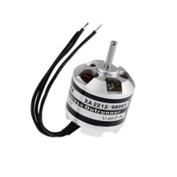

# Quadcopter-Project
IMU-supported, Android app-controlled PID-based quadcopter project.
# 🛸 Quadcopter PID Control with Raspberry Pi Pico W

This project involves the development of a custom-built quadcopter system controlled by a Raspberry Pi Pico W, utilizing a complementary filter and PID algorithms to achieve stable flight. The drone is controlled via a custom-developed Android application using UDP communication over Wi-Fi.

## 🚀 Project Highlights

- Real-time stabilization using a complementary filter (MPU6050)
- PID-based roll and pitch control
- UDP-based communication with a custom Android app
- ESC and BLDC motor control via PWM signals
- Full system built on MicroPython (Pico W) and Kotlin (Android)

## 📂 Project Structure

```
drone-pid-control/
├── code/                   # MicroPython source code for the flight controller
│   ├── main.py
│   ├── mpu6050.py
│   ├── udp_server.py
│   ├── pid.py
│   └── esc.py
│
├── android_app/            # Android app source code (UDP control interface)
│   ├── MainActivity.kt
│   ├── JoystickView.kt
│   ├── UdpClient.kt
│   ├── activity_main.xml
│   └── AndroidManifest.xml
│
├── media/                  # Images, diagrams, and demo visuals
│   ├── raspberry_pi_pico.jpg
│   ├── mpu6050.jpg
│   ├── esc_module.png
│   ├── brushless_motor.jpg
│   ├── tp4056.jpg
│   ├── lipo_battery.jpg
│   ├── system_diagram.png
│   ├── filter_chart.png
│   └── demo.gif
│
├── README.md               # Main project documentation (with visuals)
├── LICENSE                 # MIT License file
└── .gitignore              # (optional) Files to be ignored by Git
```


## 📱 Android App Interface

The Android application features dual joystick control and a real-time connectivity indicator. Commands are sent over UDP, and the drone responds with acknowledgment signals.


## 🧠 Control Algorithm

The stabilization is achieved using a complementary filter (80% gyro, 20% accelerometer) and a PID loop tuned through trial and error. The quadcopter is tested in a home environment with motors anchored for tuning.

## 🎥 Demo


## 🧰 Hardware Wiring

The image below shows how the ESCs, motors, power source, and Pico W are connected:


## 🔧 Component Overview

<table align="center">
  <tr>
    <td align="center">
      <br>
      <b>Raspberry Pi Pico</b>
    </td>
    <td align="center">
      <br>
      <b>MPU6050</b>
    </td>
    <td align="center">
      <br>
      <b>ESC Module</b>
    </td>
  </tr>
  <tr>
    <td align="center">
      <br>
      <b>Brushless Motor</b>
    </td>
    <td align="center">
      <br>
      <b>TP4056</b>
    </td>
    <td align="center">
      <br>
      <b>Li-ion Battery</b>
    </td>
  </tr>
</table>


## 🛠 Technologies Used

- Raspberry Pi Pico W (MicroPython)
- MPU6050 IMU sensor
- Android Studio (Kotlin)
- UDP Sockets
- ESCs + Brushless DC Motors

## 📜 License

This project is licensed under the MIT License – see the [LICENSE](LICENSE) file for details.
